* Link:  https://www.youtube.com/watch?v=7In1PquH5tc 

# AWS re:Invent 2022 - Secure and multi-tenant infrastructure as code with Crossplane & Argo (OPN309)

Adobe fazendo a transição **de** fornecer algumas funcionalidades ou recursos relacionados gradativamente **para** fornecer soluçoẽs de pacote ( com várias coisas combinadas).

## Problemas
* Equipes usando GitOps, porém cada uma provisionando a infraestrutura a sua maneira;

* Possuem ferramentas personalidas o que gera uma curva de aprendizado associado a elas;

* Monitoramento da infraestrutura e de recursos não computacionais de maneiras diferentes;

## Requisitos da solução
* Padronização 
* Kubernetes-native
* GitOps friendly : provisiionamento de infraestrutura e também compativel com GitOps;
* Multi-tenant
* Seguro
* Multi-Cloud
* Extensible

## Pontos Trabalhados
* Provisionamento e orquestração de infraestrutura;
* Delivery Deployment;
* Workflow Orchestration

# Argo 
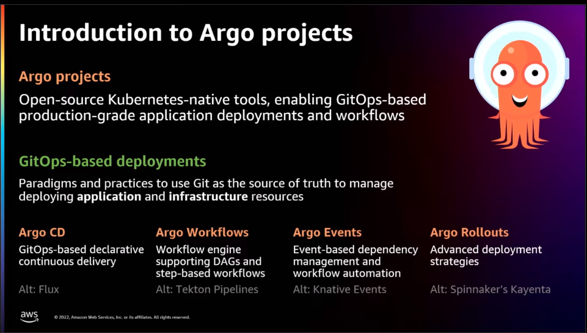
É uma coleção de projetos de código aberto que permitem a implantação de aplicativos baseados em GitOps no Kubernetes. 

## Argo-based deployments
Implantações baseadas em GitOps são paradigmas e praticas que garantem que o Git seja a fonte da verdade.
Significa que você define o estado desejado no GIt.

* Argo CD : para entrega contínua;
* Argo Workflows: provisiona workflows e o representa como uma série de etapas usando DAGs;
* Argo Events : Habilita e captura eventos  e dispara workflows;
* Argo Rollouts : Habilita recursos avançados de deployment;

# Crossplane
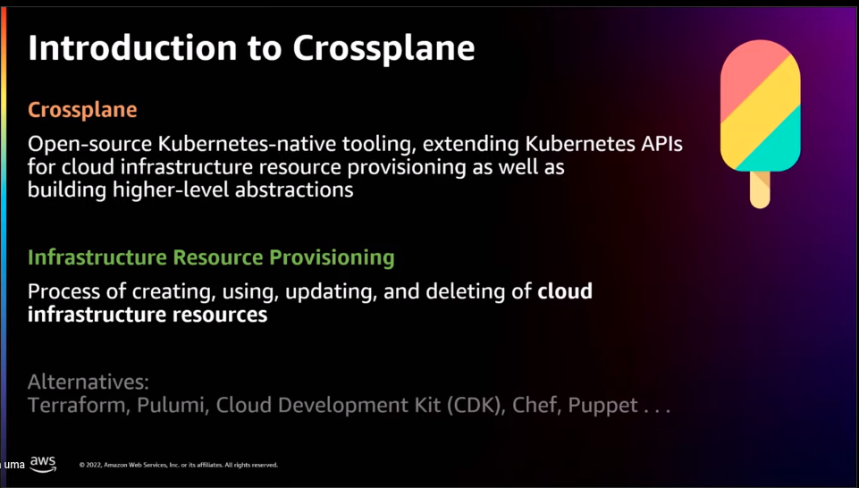

Ferramentas nativas do Kubernetes de código aberto, estende as APIS do Kubernetes para provisionamento de recursos de infraestrutura na cloud. 

## Infraestrutura para provisionamento de recursos
Esamos para criar, usar e deletar os recursos da infraestrutura em nuvem, também é possível criar control planes de autocorreção

O Crossplane é uma alternativa ao terraform, Pulumi, Chef, Puppet, etc ...

# Hub-and-spoke model
* o Cluster Hbu é o cluster central, onde cada uma das equipes do cliente obtem um namespace de hub tenant
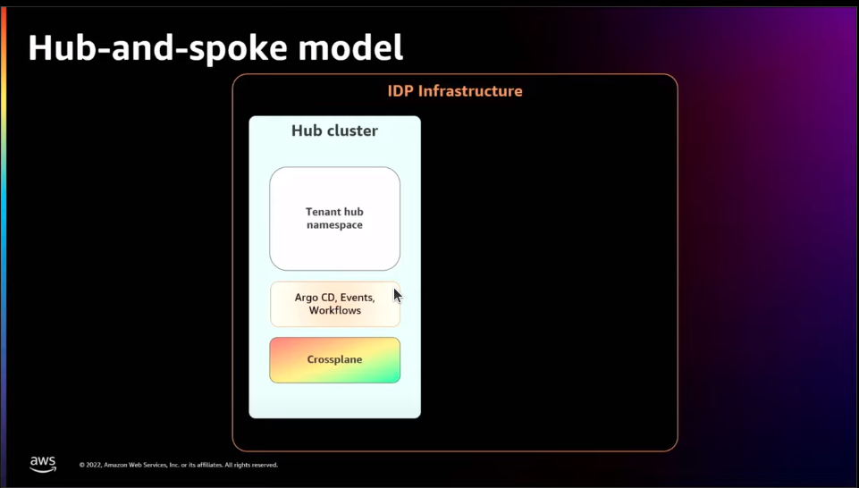

ArgoDC, Argo Events, Argo Workflors são instalados nesse cluster, bem como o crossplane.

Spokes são cluster remotos em locais distintos

o Argo Rollouts é instalado no tenant, cluster remotodo enquanto o restantes dos componentes do Argo são instalado no cluster hub.

O cluster hub se conecta a esses  clusters remotos e garante que os deployments possam acontecer.
V
Mas de onde ontém o código? 
o Cluster hub se conecta ao GitHub Corp onde estão armazenados todos os códigos e todos os repositórios 
    ( > poderia se conectar a outro local ? )
    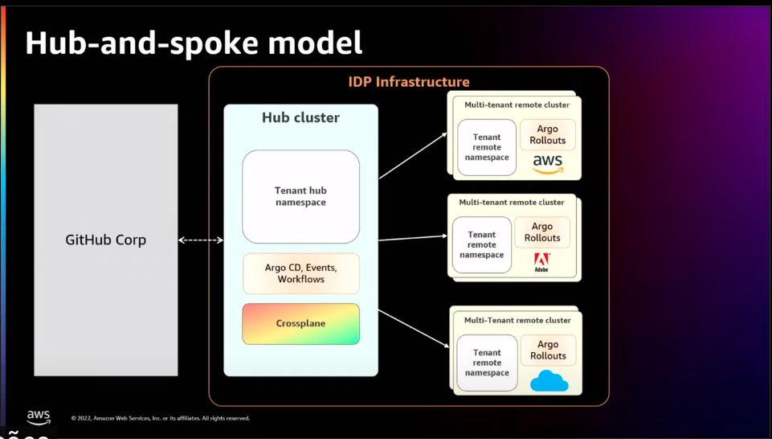

Então o Cluster Hub coreografa o Deploy do git para os clusters remotos.

# Deploy using Argo Proect

Já temos:
* Git com o código
* o Cluster Hub
* cluster remotos
* conta AWS de propriedade do tenant

Os recusos, tais como Lambda, Filas estão presentes na conta AWS do Tenant estão pré-provisionados no nomento.

No Git teremos um repositório de aplicativo cliente e um repositório de deploy de cliente para cada tenant

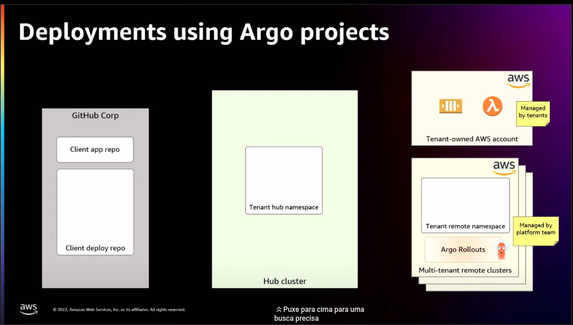

Essa é uma prática recomendda no mundo GitOps. Dois repositórios para um servi;co que temos. 

No repositorio da aplicação temos a lógica de negócio. Já no repositório de deploy temos os manifestos do kubernetes e os Helm Charts e também os manifestos Argo.

TEmos também worflows e events compartilhados, esse repositório irá conter os manifestos Argo compartilhados, que são compartilhados pelos diferentes manifestos Argo. 
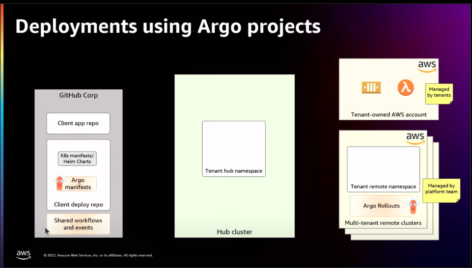

Desta forma reutilizamos e compartilhamos o c[odigo por meio deste repositório compartilhado de workflow] e events

No cluster Hub há um componente chamado de provisionador e ele tem como funÇão garantir que tudo que o cliente precisa. Eé garantir que os deploys aconteçam o provisionador é capaz de fazer. Ele é baseado no workflow do Argo, mas executa uma série de etapas e garante que tudo seja configurado antes que o deploy acontecça. 

Como acontece:

Se o namespace do hub do tenant, se ele ainda não existir. 
Criará o workflow
events de deploy
Serão criados vários ArgoCd applications no cluster hub;

Para garantir que possamos fazer o GitOps usando-os 

# Workflow de ponta-a-ponta

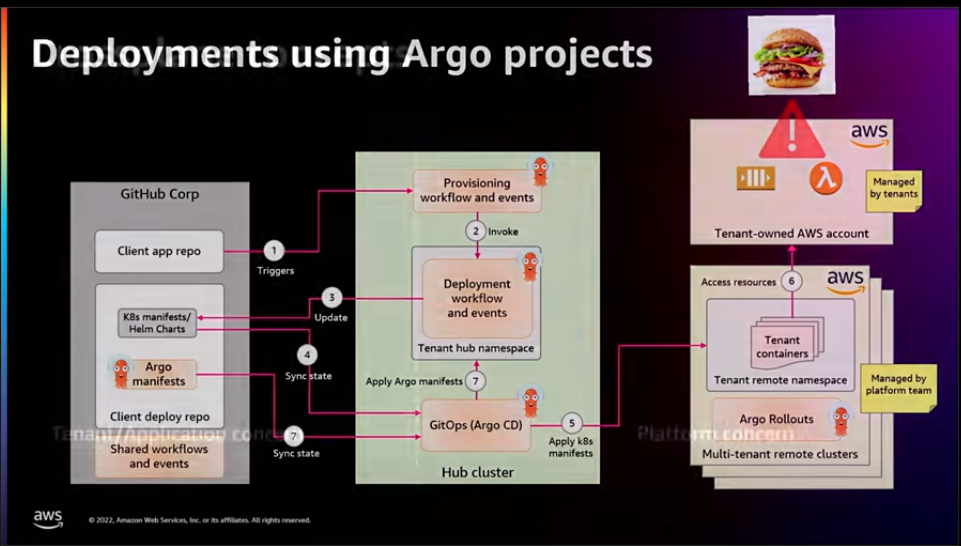
    
# crossplane

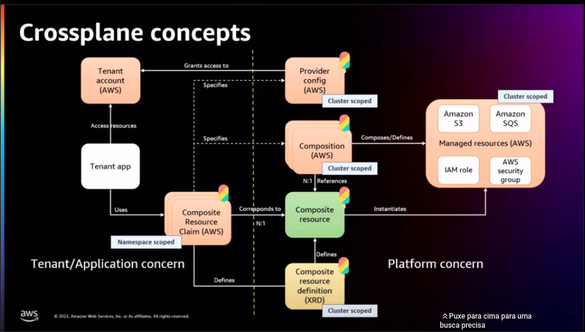

# Infra provisioning using Crossplane + Argo

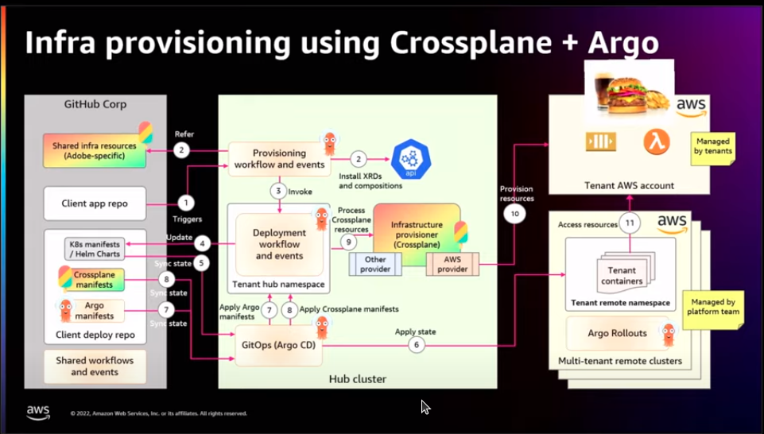

# Security 

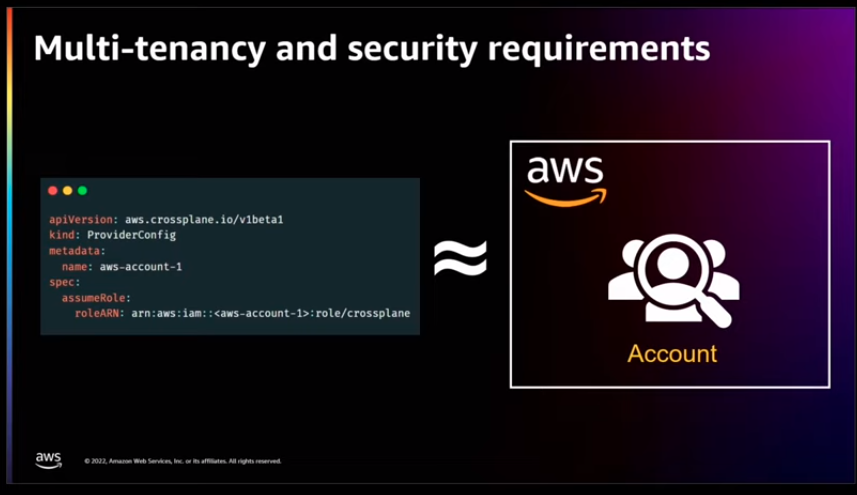

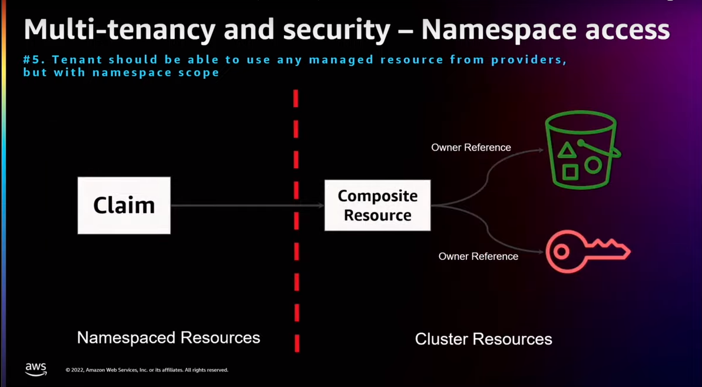

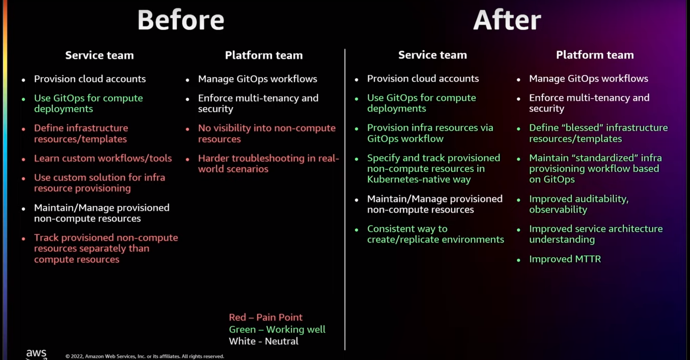

